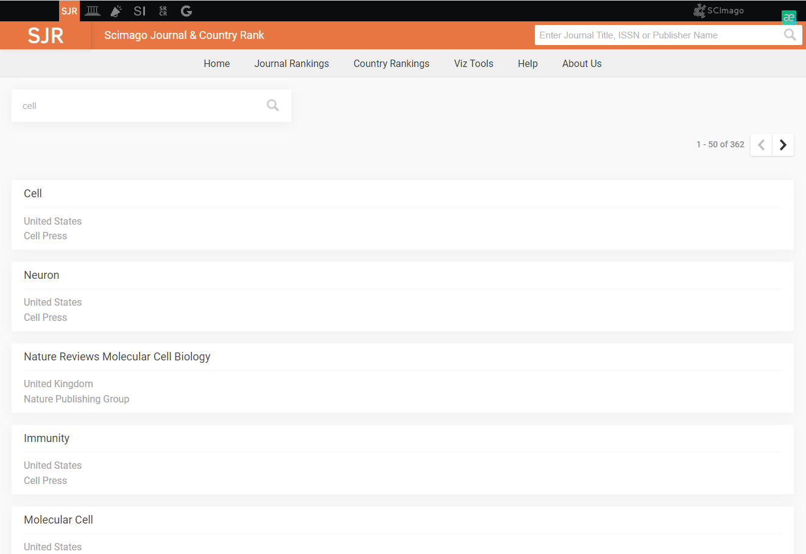
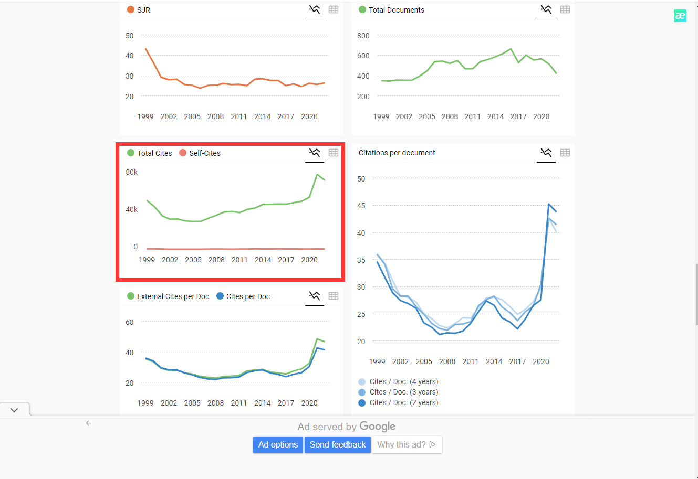
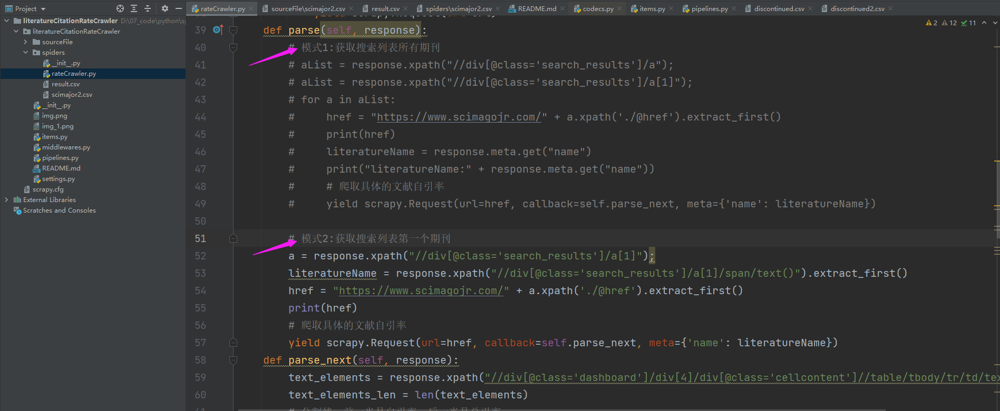
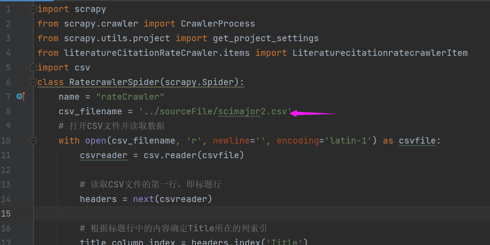
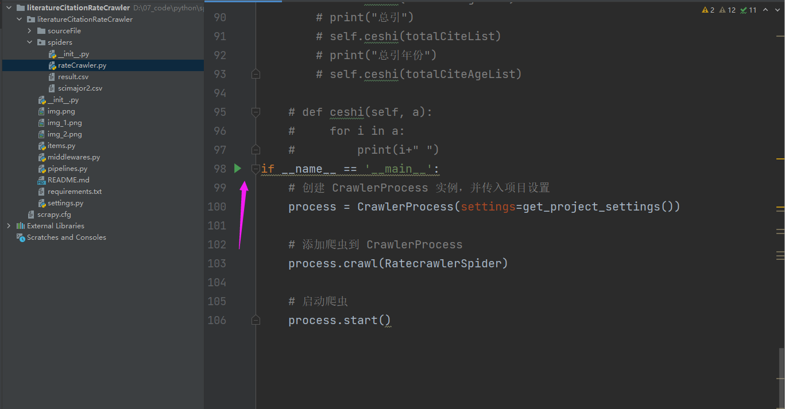

# literatureCitationRateCrawler
## 项目介绍
本项目用于爬取https://www.scimagojr.com/ 网站内某个期刊的自引率和总引率

搜索期刊名(eg:Nature Medicine)会得到期刊列表,本项目默认爬取列表中第一个期刊，爬取整个列表的代码已实现，
在literatureCitationRateCrawler/spiders/rateCrawler.py里你可以根据需要选择爬取模式。(通过增加去除代码块注释的方法)

爬取框图内的文献自引率和总引率

### 前置知识
本项目使用scrapy框架，你需要了解scrapy框架下的项目结构，了解请求的发送和对返回数据的接收与处理，
item中数据类型的定义与生成（爬取数据时需要定义数据类型），以及管道的定义与启停（涉及到数据下载）
## 环境
python3.8

Scrapy==2.8.0

requests==2.31.0
## 项目启动
爬取核心逻辑在literatureCitationRateCrawler/spiders/rateCrawler.py中
### 设置源文件
1.源文件中包含你要爬取的期刊名，我将其放在literatureCitationRateCrawler/sourceFile目录下
2.修改rateCrawler.py中文件地址

### 设置输出文件名及位置
在literatureCitationRateCrawler/pipelines.py中
### 启动项目

## 输出格式
期刊名

    年份   年份

    自引率 总引率

在literatureCitationRateCrawler/spiders下有样例输出，用户可自行查看

## Authors
- [@s7zr](https://github.com/s7zr)